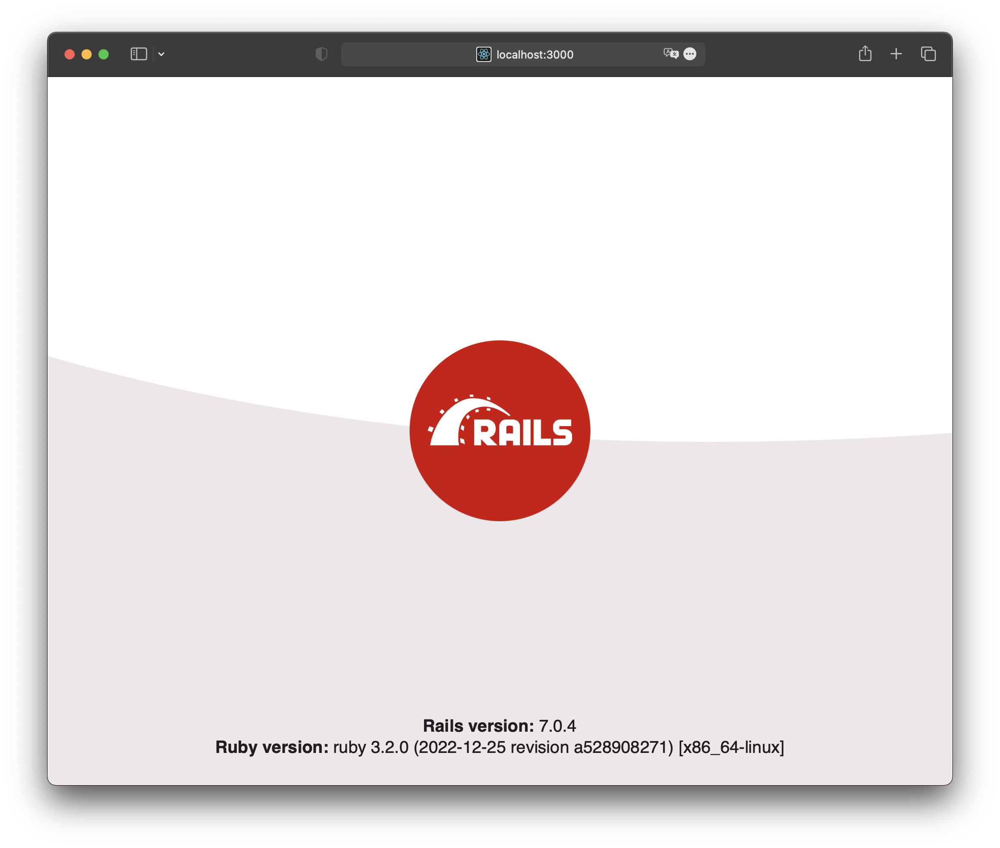

# Docker for Ruby

Based on https://github.com/docker/awesome-compose/tree/master/official-documentation-samples/rails/ conception.

Useful for creating new, empty application.

## Step 1

Clone this repository or copy to your project these files:

- `.env`
- `docker-compose.yaml`
- `Dockerfile`
- `entrypoint.sh`
- `Gemfile`
- `Gemfile.lock`

All files from root directory, besides `images/`, `.gitattributes` and `README.md`.

## Step 2

Create new Rails application:

```shell
$ docker compose run --rm --build --no-deps web rails new . --force --database=postgresql
```

## Step 3

`Gemfile` has different content after new Rails application has been created, so you have to build Docker image once
again:

```shell
$ docker compose build
```
## Step 4

Configure database connection:

1. Open `config/database.yml` file
2. Find `default: &default` section:

    ```yaml
    default: &default
      adapter: postgresql
      encoding: unicode
      # For details on connection pooling, see Rails configuration guide
      # https://guides.rubyonrails.org/configuring.html#database-pooling
      pool: <%= ENV.fetch("RAILS_MAX_THREADS") { 5 } %>
    ```

3. Append these options at the end:

    ```yaml
    host: db
    username: app
    password: p4ssw0rd
    ```

    So the `default: &default` section may look like this:

    ```yaml
    default: &default
      adapter: postgresql
      encoding: unicode
      # For details on connection pooling, see Rails configuration guide
      # https://guides.rubyonrails.org/configuring.html#database-pooling
      pool: <%= ENV.fetch("RAILS_MAX_THREADS") { 5 } %>
      host: db
      username: app
      password: p4ssw0rd
    ```

## Step 5

Let's start all containers:

```shell
$ docker compose up -d
```

## Step 6

Create all databases:

```shell
$ docker compose exec web rake db:create
```

## Step 7

Open application by entering http://localhost:3000 in web browser:



Enjoy!
